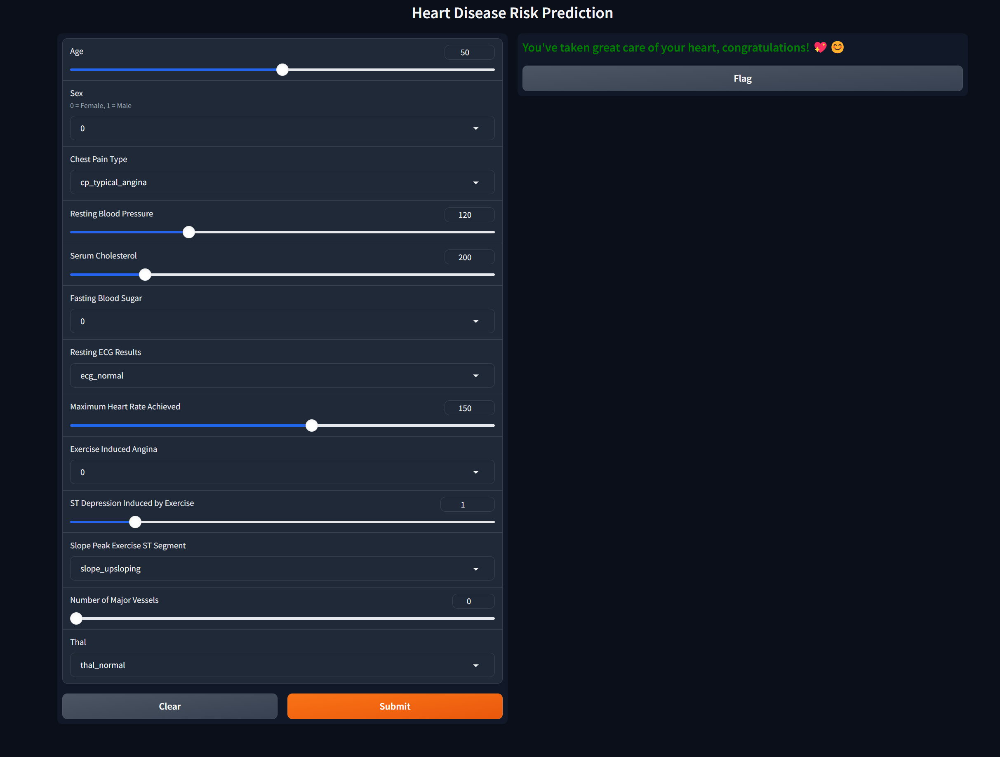

# Cardiovascular Disease Prediction Project



## Project Description
In this project, a machine learning model will be developed to predict cardiovascular diseases. The provided dataset contains various patient attributes and information about their cardiovascular disease status. The goal is to perform the necessary data preprocessing and feature engineering steps to improve the disease prediction accuracy using this dataset.


---

Dataset: [Heart Disease Dataset](https://archive.ics.uci.edu/dataset/45/heart+disease)


```pip install ucimlrepo```

```
from ucimlrepo import fetch_ucirepo 
# fetch dataset 
heart_disease = fetch_ucirepo(id=45) 
# data (as pandas dataframes) 
X = heart_disease.data.features 
y = heart_disease.data.targets 
# metadata 
print(heart_disease.metadata) 
# variable information 
print(heart_disease.data.variables)
heart_disease.variables)
```

**Explanation of Dataset Features:**

1. **Age** - Contains numerical information about the person's age.
2. **Sex** - Indicates the person's gender (1 = male; 0 = female).
3. **Chest Pain Type (4 values)** - Indicates the type of chest pain (1: Typical angina, 2: Atypical angina, 3: Non-anginal pain, 4: Asymptomatic).
4. **Resting Blood Pressure** - Resting blood pressure (in mm Hg).
5. **Serum Cholesterol in mg/dl** - Serum cholesterol level (in mg/dl).
6. **Fasting Blood Sugar > 120 mg/dl** - Is the fasting blood sugar level greater than 120 mg/dl (1 = true; 0 = false).
7. **Resting ECG results (values 0, 1, 2)** - Resting electrocardiogram results (0: Normal, 1: ST-T wave abnormalities, 2: Left ventricular hypertrophy or T wave inversion).
8. **Maximum Heart Rate achieved** - Maximum heart rate achieved.
9. **Exercise Induced Angina** - Exercise-induced angina (1 = yes; 0 = no).
10. **ST depression induced by exercise relative to rest** - ST segment depression induced by exercise relative to rest.
11. **Slope of the peak exercise ST segment** - Slope of the peak exercise ST segment (1: Upsloping, 2: Flat, 3: Downsloping).
12. **Number of major vessels (0-3) colored by fluoroscopy** - Number of major vessels colored by fluoroscopy (between 0-3).
13. **Thal** - Thalassemia status (3 = normal; 6 = fixed defect; 7 = reversible defect).


---

**Target variable**: Presence of heart disease - Indicates whether the person has heart disease (1 = disease; 0 = no disease).


---

**Numerical and Categorical Features**

**Numerical Features**
- age: integer
- resting_blood_pressure: integer
- serum_cholesterol: integer
- maximum_heart_rate_achieved
- st_depression_induced_by_exercise
- number_major_vessels

**Categorical Features**
- sex
- chest_pain_type
- fasting_blood_sugar
- resting_ecg_results
- exercise_induced_angina
- thal
- slope_peak_exercise_st_segment
- presence_of_heart_disease (Target)


---

### Tech Stack:

- Programming Language: `Python`   
      
- Model tracking: `MLflow`
  
- Fronthand: `Gradio`
  
- Backend: `FastAPI`
  
- Versiyon kontrol: `Git`

## Installation:
```
git clone https://github.com/kntvrl/heart_disease_project.git
cd heart_disease_project
pythom -m venv venv
pip install -r requirements.txt
python hearth_app.py
```

## To start MLflow tracking:
Open terminal and type

`mlflow ui `

## You can access the UI via the following URL:
## http://127.0.0.1:5000

