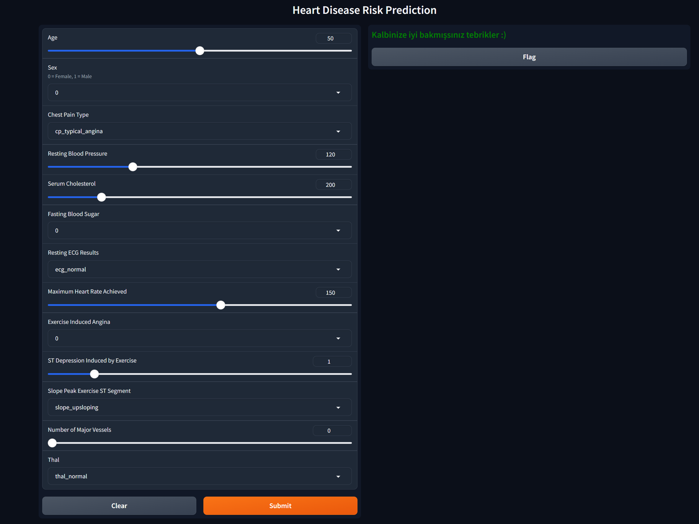

# Case Study Projesi: Kardiyovasküler Hastalık Tahmini


## Proje Açıklaması
Bu projede, kardiyovasküler hastalıkları tahmin etmek için bir makine öğrenmesi modeli geliştirilecektir. Verilen veri seti, çeşitli hasta özelliklerini ve bu hastaların kardiyovasküler hastalık durumu hakkında bilgi içermektedir. Amaç, bu veri setini kullanarak hastalık tahmin doğruluğunu artırmak için gerekli veri işleme ve özellik mühendisliği adımlarını gerçekleştirmektir.

---

Kullanılacak veri seti: [Heart Disease Dataset](https://archive.ics.uci.edu/dataset/45/heart+disease)

Kurulum:
```pip install ucimlrepo```

Kullanım:
```
from ucimlrepo import fetch_ucirepo 
# fetch dataset 
heart_disease = fetch_ucirepo(id=45) 
# data (as pandas dataframes) 
X = heart_disease.data.features 
y = heart_disease.data.targets 
# metadata 
print(heart_disease.metadata) 
# variable information 
print(heart_disease.data.variables)
heart_disease.variables)
```

**Veri setinin Özelliklerinin açıklamaları:**

1. **Age: Yaş** - Kişinin yaşı hakkında sayısal bilgi içerir.
2. **Sex: Cinsiyet** - Kişinin cinsiyetini belirtir (1 = erkek; 0 = kadın).
3. **Chest Pain Type (4 values)** - Göğüs ağrısı türünü belirtir (1: Tipik angina, 2: Atipik angina, 3: Non-anginal ağrı, 4: Asemptomatik).
4. **Resting Blood Pressure** - Dinlenme halindeki kan basıncı (mm Hg cinsinden).
5. **Serum Cholesterol in mg/dl** - Serum kolesterol düzeyi (mg/dl cinsinden).
6. **Fasting Blood Sugar > 120 mg/dl** - Açlık kan şekeri seviyesi 120 mg/dl'nin üzerinde mi (1 = doğru; 0 = yanlış).
7. **Resting ECG results (values 0, 1, 2)** - Dinlenme halindeki elektrokardiyografi sonuçları (0: Normal, 1: ST-T dalga anormallikleri, 2: Sol ventrikül hipertrofisi veya T dalga inversiyonu).
8. **Maximum Heart Rate achieved** - Ulaşılan maksimum kalp hızı.
9. **Exercise Induced Angina** - Egzersizle indüklenen angina (1 = evet; 0 = hayır).
10. **ST depression induced by exercise relative to rest** - Egzersizle indüklenen ST segmenti depresyonu (dinlenmeye göre).
11. **Slope of the peak exercise ST segment** - Egzersiz sırasında zirve ST segmentinin eğimi (1: Yukarı eğimli, 2: Düz, 3: Aşağı eğimli).
12. **Number of major vessels (0-3) colored by fluoroscopy** - Floroskopi ile boyanmış ana damar sayısı (0-3 arası).
13. **Thal** - Talasemi durumu (3 = normal; 6 = sabit defekt; 7 = geri dönebilen defekt).

---

**Hedef değişken**: Presence of heart disease (Kalp hastalığı varlığı) - Kalp hastalığı olup olmadığını belirtir (1 = hastalık; 0 = hastalık yok).


---

**Sayısal ve kategorik özellikler**

**Sayısal özellikler**
- age: integer
- resting_blood_pressure: integer
- serum_cholesterol: integer
- maximum_heart_rate_achived
- st_depression_induced_by_exercise
- number_major_vessels

**Sayısal kategorik özellikler**
- sex
- chest_pain_type
- fasting_blood_sugar
- resting_ecg_results
- exercise_induced_angina
- thal
- slope_peak_exercise_st_segment
- presence_of_heart_disease (Target)

---

### Projede kullanılan teknolojiler ve kurulum:

- Proglamlama dili: `Python`   
      
- Model tracking: `MLflow`
  
- Fronthand: `Gradio`
  
- Backend: `FastAPI`
  
- Versiyon kontrol: `Git`

Kurulum:
```
git clone https://github.com/kntvrl/kodlasam_hearth_disease_project.git
cd kodlasam_hearth_disease_project
pythom -m venv venv
pip install -r requirements.txt
python hearth_app.py
```


[Projenin yüklendiği Github sayfam](https://github.com/kntvrl/kodlasam_hearth_disease_project)


